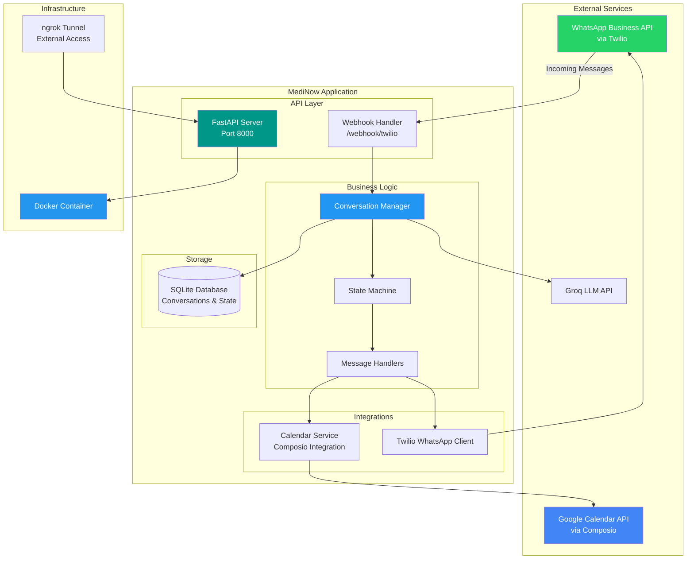

# 🏥 MediNow - WhatsApp Medical Appointment Bot

A WhatsApp chatbot for medical appointment scheduling using natural language, integrated with Google Calendar and designed for easy scalability across multiple doctors and clinics.

## 🎯 Overview

MediNow solves the pain point of difficulty and delays in finding and booking medical appointments by providing a conversational WhatsApp interface. Users can schedule, check, reschedule, and cancel appointments using natural language.

**Current Scope**: Porto Feliz with one doctor  
**Future**: Scalable architecture for multiple doctors and clinics

## 🏗️ Architecture



## 🚀 Quick Start

### Prerequisites
- Docker & Docker Compose
- ngrok account and authtoken
- Twilio WhatsApp Business account
- Groq API key
- Composio API key

### Setup

1. **Configure Environment**
   ```bash
   cp .env.example .env
   # Edit .env with your API keys and credentials
   ```

2. **Start Application**
   ```bash
   cd scripts/
   ./docker-run run
   ```

3. **Setup External Access**
   ```bash
   ./ngrok-setup setup
   ```

4. **Configure Twilio Webhook**
   - Get ngrok URL: `./ngrok-setup info`
   - Set Twilio webhook: `https://your-url.ngrok.io/webhook/twilio`

## 💬 Conversation Flow

The bot handles multiple conversation types:

- **📅 Scheduling**: Request appointment → Check availability → Collect data → Confirm
- **🔍 Consultation**: Check existing appointments by user identity
- **📝 Rescheduling**: Find appointment → Choose new time → Update calendar
- **❌ Cancellation**: Find appointment → Confirm cancellation
- **🔔 Proactive**: Bot suggests available slots for the day

### Context Management
- Never terminates session on topic changes
- Saves context and returns to previous flow
- Only ends session when user shows no scheduling interest

## 🛠️ Technology Stack

| Component | Technology | Purpose |
|-----------|------------|---------|
| **Backend** | FastAPI + Python 3.13 | REST API and webhook handling |
| **AI/LLM** | Groq API | Natural language processing |
| **Calendar** | Google Calendar via Composio | Appointment management |
| **Messaging** | Twilio WhatsApp API | WhatsApp integration |
| **Database** | SQLite | Conversation state and history |
| **Deployment** | Docker + docker-compose | Containerization |
| **Tunneling** | ngrok | External webhook access |

## 📁 Project Structure

```
medinow/
├── main.py                    # Application entry point
├── pyproject.toml            # Dependencies and project config
├── backend/                  # Core application
│   ├── api/                 # FastAPI endpoints
│   ├── agents/              # Conversation logic
│   ├── integrations/        # External service integrations
│   └── storage/             # Database and persistence
├── scripts/                 # Management and deployment scripts
├── docker/                  # Docker configuration
└── docs/                    # Documentation (requirements only)
```

## 🔧 Management Commands

```bash
# Docker Management
cd scripts/
./docker-run run             # Start application
./docker-run health          # Check health status
./docker-run logs            # View application logs
./docker-run stop            # Stop application

# ngrok Management  
./ngrok-setup setup          # Complete setup
./ngrok-setup start-bg       # Start tunnel in background
./ngrok-setup info           # Get tunnel URLs
./ngrok-setup status         # Show complete status
```

## 📋 Requirements

For detailed requirements, conversation flows, and business logic, see [docs/requisitos.md](docs/requisitos.md).

## 🚀 Production Deployment

The application is containerized and ready for deployment to cloud platforms:
- **Cloud Platforms**: DigitalOcean, AWS ECS, Google Cloud Run, Azure Container Instances
- **VPS**: Use included nginx configuration for reverse proxy
- **Docker Registry**: Build and push the container image

## 📞 API Endpoints

| Endpoint | Method | Purpose |
|----------|--------|---------|
| `/api/health` | GET | Health check |
| `/webhook/twilio` | POST | WhatsApp webhook |
| `/api/chat` | POST | Direct chat interface |
| `/api/calendar/events` | POST | Create calendar events |
| `/api/calendar/available-slots` | GET | Get available time slots |

---

**Built for simplicity, designed for scale** 🎯
