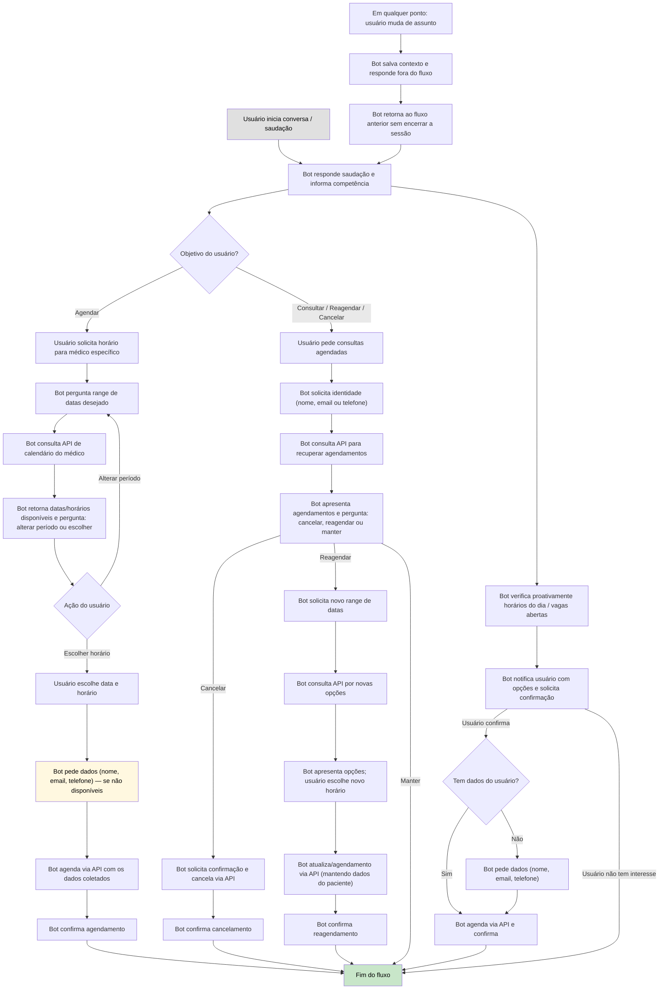

# Requisitos para construção do medibot

Necessidade/dor do usuário: dificuldade/demora para conseguir encontrar e marcar horário de algum médico de forma prática e rápida. 

Proposta de solução: Usar um chatbot que integre com o whatsapp, assim a pessoa pode com linguagem natural entrar em contato e marcar rapidamente uma consulta com o médico, usando somente whatsapp é prático e com o agente consegue isso rápido.

Por enquanto a localidade é somente Porto Feliz e usará somente com um médico, mas a arquitetura precisa ser genérica para facilitar a inclusão de novos médicos e consultórios no futuro.

Fluxo da conversa

O fluxo abaixo descreve as etapas que o usuário e o bot percorrem para realizar o agendamento de uma consulta médica de forma simples e eficiente.

Fluxo unificado de conversas: agendamento, consulta, reagendamento e cancelamento

Abaixo está um diagrama mermaid que representa visualmente o fluxo de conversas entre o usuário e o bot para agendamento, consulta, reagendamento e cancelamento de consultas médicas.

Observações rápidas:
- Nunca encerrar a sessão por troca de assunto: salvar contexto, responder e voltar ao fluxo.
- Encerrar apenas se o usuário indicar desinteresse em agendar.
- Fluxo deve ser simples e sem overengineering (MVP).
- Incluir lógica para reutilizar dados já conhecidos do usuário quando possível (evita pedir repetidamente).
- Permitir reentrada no fluxo após ações proativas.

Além dessa parte, preciso que o sistema seja ativo em buscar os horários do dia e informar o usuário via mensagem, solicitando confirmação.

Se em alguma parte do fluxo da conversa o usuário mudar de assunto do contexto o bot precisa voltar ao contexto mas não encerrar a sessão. Apenas encerrar a sessão se o usuário dar indícios de que não demonstrar interesse em agendar horário.

Não use overengineering nesse caso, visto que o sistema precisa ser um mvp, custo baixo de manutenção e inicia-se com poucos médicos/demandas.

Verifique qual framework python é mais fácil de usar para este caso (rápido de construir e tranquilo de manutenção), ou se nesse caso não precisa de framework.

